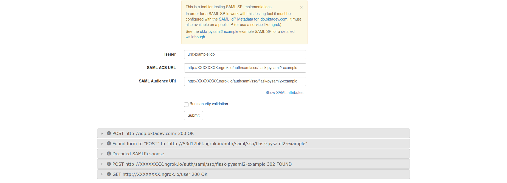

# Introduction

This is an example SAML SP service written using [Flask](https://palletsprojects.com/p/flask/)
and [pysaml2](https://github.com/rohe/pysaml2). It is an attempt at modernizing
an [existing project](https://github.com/jpf/okta-pysaml2-example) while also following
the design used in Flask's tutorial project.

# Requirements

- [python](https://www.python.org/) 3.6+
- [virtualenv](https://virtualenv.pypa.io/en/latest/) (or [conda](https://docs.conda.io/en/latest/))
- [pip](https://pip.pypa.io/en/stable/)

You will also need a development environment capable of compiling Python packages and the
"libffi" and "libxmlsec1" development libraries, which are needed by PySAML2.

Instructions for installing these development libraries will differ depending on your
host operating system.

Optionally, you will also need to install [ngrok](https://ngrok.com/download) if you want to validate
the SP externally.

## Mac OS X

```shell
$ brew install libffi libxmlsec1
```

## RHEL/Fedora/CentOs

```shell
$ sudo yum install libffi-devel xmlsec1 xmlsec1-openssl
```

## Debian/Ubuntu

```shell
$ sudo apt-get install libffi-dev xmlsec1 libxmlsec1-openssl
```

# Installation

## virtualenv

```shell
$ virtualenv venv
$ source venv/bin/activate
$ pip install -r requirements.txt 
```

## conda

```shell
$ conda create --name flask-pysaml2-example python=3
$ conda activate flask-pysaml2-example
$ pip install -r requirements.txt
```

# Running

 ```shell
$ FLASK_APP=flask_pysaml2_example flask run
 ```

 # Testing

 The fastest way to test this example SAML SP is to use the [saml.oktadev.com](http://saml.oktadev.com/) service.

 1.  Edit the "flask_pysaml2_example/__init__.py" file and edit the appropriate entry in the
     `SAML_IDP_SETTINGS` Flask config value, changing this:
    
    ```python
    app.config.from_mapping(
        SECRET_KEY='dev',
        SQLALCHEMY_TRACK_MODIFICATIONS=False,
        SQLALCHEMY_DATABASE_URI=f'sqlite:///{Path(app.instance_path) / "flask_pysaml2_example.sql"}',
        SAML_IDP_SETTINGS={
            # Add the settings for each IDP you want to use. Each entry in the
            # dictionary requires to keys:
            #
            # entityid: An identifier for the SP. Usually this is the same as the Single Sign On URL.
            #           It will default to the SSO URL if left empty or undefined.
            # metadata_url: This is the metadata URL for the IDP.
            #
            # This configuration can be used with http://saml.oktadev.com/
            # 'example-oktadev': {
            #    'entityid': 'http://<replace-me>.ngrok.io/auth/saml/sso/flask-pysaml2-example',
            #    'metadata_url': 'http://idp.oktadev.com/metadata'
            # },
            # 
            # This configuration can be used with a real https://www.okta.com/ app.
            # 'example-okta': {
            #    'entityid': 'http://<replace-me>.ngrok.io/auth/saml/sso/example-okta',
            #    'metadata_url': 'https://dev-XXXXX.okta.com/app/XXXXXXXXXXXXXXXXXXXXXXXXX/sso/saml/metadata'
            # }
        }
    )
    ```
    
    To this:
    
    ```python
    app.config.from_mapping(
        SECRET_KEY='dev',
        SQLALCHEMY_TRACK_MODIFICATIONS=False,
        SQLALCHEMY_DATABASE_URI=f'sqlite:///{Path(app.instance_path) / "flask_pysaml2_example.sql"}',
        SAML_IDP_SETTINGS={
            'example-oktadev': {
               'entityid': 'http://<replace-me>.ngrok.io/saml/sso/example-oktadev',
               'metadata_url': 'http://idp.oktadev.io/metadata'
            }
        }
    )
    ```

    Ignore the ``entityid`` key for the moment as it'll have to be changed once the application is
    up and running.


2.  Start the example SAML SP
    
    ```shell
    $ FLASK_APP=flask_pysaml2_example FLASK_DEBUG=1 flask run --port 5000
    ```

3.  Start ngrok on the port that the example SAML SP is running on, in this case 5000/tcp.
    
    ```shell
    $ ngrok http 5000
    ```

4.  Replace the "<replace-me>" place holder with the assigned ngrok sub-domain in the `entityid` key in the
    "flask_pysaml2_example/__init__.py" file. If Flask was started using `FLASK_DEBUG=1`, the application
    will be restarted automatically, otherwise, you'll have to stop it and start it again.

5.  Run [saml.oktadev.com](http://saml.oktadev.com) to test this example SAML SP

    -   Load [saml.oktadev.com](http://saml.oktadev.com) in your browser and fill out as follows:
        
        **Issuer:** "urn:example:idp"
        **SAML ACS URL:** "<http://<replace-me>.ngrok.io/saml/sso/flask-pysaml2-example>"
        **SAML Audience URI:** "<http://<replace-me>.ngrok.io/saml/sso/flask-pysaml2-example>"
        
        Be sure to replace the string "<replace-me>" with the sub-domain that ngrok selected for you!
    
    -   Click the "Submit" button.

    -   If the interaction was successful, the output will be similar to one in the following screenshot:
        

The application can also be used to follow the ["SAML-enable your Python application"](https://developer.okta.com/code/python/pysaml2/)
guide.

# Testing the security of your SAML SP

After successfully completing the steps in the "Testing" section above, select the "Run security
validation" option to have saml.oktadev.com run an extended series of security tests against your
SAML SP.
