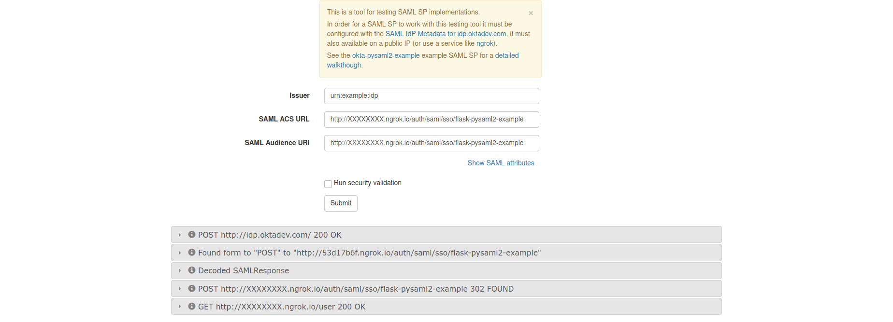

# Introduction

This project is a SAML Service Provider (SP) example built with
[Flask](https://palletsprojects.com/p/flask/) and
[pysaml2](https://github.com/IdentityPython/pysaml2).

It demonstrates a complete SP-initiated SSO flow and includes defaults that are
safer for real-world deployments:

- AuthnRequest/Response correlation using request IDs.
- RelayState validation to prevent open redirects.
- Cached IdP metadata fetch with timeout.
- Configurable SAML attribute mapping for JIT provisioning.
- SP metadata endpoint for easier IdP onboarding.

## What this example includes

- Login start endpoint: `/auth/saml/login/<idp_name>`
- Assertion Consumer Service (ACS): `/auth/saml/sso/<idp_name>`
- SP metadata endpoint: `/auth/saml/metadata/<idp_name>`
- Local user session with `flask-login`
- JIT user provisioning into SQLite

# Requirements

- [python](https://www.python.org/) 3.11+
- [poetry](https://python-poetry.org/)

You also need build dependencies for PySAML2 (`libffi` and `xmlsec1`).

## Mac OS X

```shell
brew install libffi libxmlsec1
```

## RHEL/Fedora/CentOS

```shell
sudo yum install libffi-devel xmlsec1 xmlsec1-openssl
```

## Debian/Ubuntu

```shell
sudo apt-get install libffi-dev xmlsec1 libxmlsec1-openssl
```

# Installation

```shell
poetry install
```

# Configuration

Prefer config file or environment variables over editing application code.

## Option A: instance config file

Create `instance/config.py` and start from
[`config.py.example`](./config.py.example).

## Option B: environment variable for IdP settings

You can pass IdP settings as JSON:

```shell
export SAML_IDP_SETTINGS_JSON='{"example-oktadev":{"entityid":"http://flask-pysaml2-example","metadata_url":"https://dev-12345678.okta.com/app/foobar/sso/saml/metadata","want_response_signed":true}}'
```

# Running

```shell
FLASK_APP=flask_pysaml2_example FLASK_DEBUG=1 flask run --port 5000
```

Or with Docker:

```shell
docker compose up
```

# SAML Flow (SP-Initiated)

```text
Browser -> Flask SP: GET /auth/saml/login/<idp>
Flask SP -> Browser: 302 to IdP SSO URL (+ AuthnRequest, RelayState)
Browser -> IdP: AuthnRequest
IdP -> Browser: HTML form POST (SAMLResponse + RelayState)
Browser -> Flask SP: POST /auth/saml/sso/<idp>
Flask SP: verify response, verify InResponseTo, provision user, create session
Flask SP -> Browser: 302 to safe RelayState (or /user)
```

# Quick Validation with saml.oktadev.com

1. Run the Flask app and expose it through ngrok:

```shell
ngrok http 5000
```

2. Open `http://saml.oktadev.com` and configure:

- `Issuer`: `urn:example:idp`
- `SAML ACS URL`: `http://<replace-me>.ngrok.io/auth/saml/sso/example-oktadev`
- `SAML Audience URI`: `http://flask-pysaml2-example`

3. (Recommended) import SP metadata from:

- `http://<replace-me>.ngrok.io/auth/saml/metadata/example-oktadev`

4. Submit and verify login succeeds.

If successful, output will be similar to:


# Security Validation

After basic validation, run the extended checks in saml.oktadev.com using
**Run security validation**.

# Minimal Production Checklist

- Use HTTPS everywhere (ACS, metadata endpoint, app base URL).
- Set a strong `SECRET_KEY`.
- Keep `SESSION_COOKIE_SECURE=true` in production.
- Keep `allow_unsolicited` disabled (enabled requests must be correlated).
- Require signed assertions and preferably signed responses.
- Validate RelayState against same-host or explicit allowlist.
- Cache IdP metadata with timeout and monitor certificate rotation.
- Log authentication events, but avoid logging full assertions/PII payloads.

# Tests

Run unit tests:

```shell
python3 -m unittest discover -s tests -p 'test_*.py'
```
